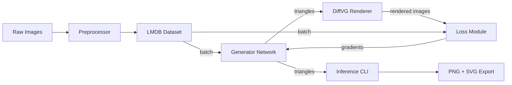

**TriangulateAI – Product Requirements Document (PRD)**
*(Version 1.0 – Detailed for LLM-driven Implementation)*

---

## 1  |  Executive Summary

**TriangulateAI** is a Python-based neural-network application that converts any RGB image (or batch of images) into a stylized approximation composed of *n* translucent triangles. It outputs both a rendered raster (PNG) and a vector graphic (SVG). Training occurs end-to-end on a single NVIDIA GPU (32 GB), using differentiable vector rendering and perceptual losses to ensure human-recognizable fidelity.

---

## 2  |  Objectives & Success Metrics

| Objective ID | Description                                                                            | Acceptance Criteria                                                                                                                                         |
| ------------ | -------------------------------------------------------------------------------------- | ----------------------------------------------------------------------------------------------------------------------------------------------------------- |
| O1           | **End-to-End Pipeline**: From raw images to trained model and inference outputs.       | – CLI commands `train`, `infer`, `export-svg` run without errors.<br>– Sample 512×512 image → 100 triangles → PNG+SVG in ≤ 1 s inference time.              |
| O2           | **Perceptual Quality**: Rendered triangle output is recognizable and stylized.         | – On held-out set, **LPIPS** ≤ 0.18 **and** **SSIM** ≥ 0.72.<br>– Human A/B survey: ≥ 80 % preference for TriangulateAI output vs. baseline MSE-only model. |
| O3           | **GPU-Only Training**: All forward, render, and backward passes occur on GPU memory.   | – Peak GPU usage < 28 GB (32 GB card) during training.<br>– No CUDA-host synchronizations beyond epoch checkpoints.                                         |
| O4           | **Configurable Research Playground**: Hyperparameters adjustable without code changes. | – All parameters in a YAML config schema.<br>– CLI flags override any YAML setting.                                                                         |
| O5           | **SVG Export**: The generated triangle data is convertible to valid SVG.               | – Exported `.svg` opens in Inkscape/Illustrator with visually identical geometry and colors to the PNG.                                                     |

---

## 3  |  Stakeholders

* **Product Owner (PO):** Oversees requirements, prioritizes features.
* **ML Engineer:** Implements models, training loops, losses.
* **DevOps Engineer:** Creates Docker images and CI/CD pipeline.
* **QA/Test Engineer:** Writes unit/integration tests, benchmarks, and human evaluation scripts.
* **Designer:** Provides visual evaluation criteria and survey assets.

---

## 4  |  User Stories & Scenarios

1. **Training Pipeline**

   * *As an ML Engineer,* I want to run `triangulate_ai train --config config.yaml` so that a model trains on an image dataset using DiffVG and perceptual losses, saving checkpoints automatically.

2. **Inference & Rendering**

   * *As a Designer,* I want to run `triangulate_ai infer model.pt --input img.jpg --output out.png --svg out.svg` to produce both PNG and SVG of the triangle approximation.

3. **Hyperparameter Tuning**

   * *As a Researcher,* I want to adjust triangle count (`n`), image size, encoder depth, and loss weights in `config.yaml` without modifying source code.

4. **Quality Evaluation**

   * *As a QA Engineer,* I want to run `triangulate_ai eval model.pt --dataset val/ --metrics lpis,ssim,psnr` to generate per-image and aggregate metrics.

---

## 5  |  Functional Requirements (FR)

### FR-1: Preprocessor

* **Description:**

  * Load images (various formats: JPEG, PNG, TIFF).
  * Resize (maintaining aspect ratio with padding) to `image_size` (default 256×256).
  * Normalize pixel values to \[0,1].
  * Optional augmentations: random horizontal flip, HSV jitter ±10 %.
  * Store preprocessed tensors in an LMDB database for fast streaming.
* **Inputs:** Directory path or file list.
* **Outputs:** LMDB with keys: `train_<idx>`, `val_<idx>`.
* **Acceptance Criteria:**

  * Running `triangulate_ai preprocess --input-dir images/ --output-db data.lmdb` produces a valid LMDB.
  * LMDB contains exactly the number of images found (counts match) and each tensor has shape `(3, H, W)` where `H=W=image_size`.
  * Augmentations applied only in training split.

### FR-2: Generator Network

* **Description:** CNN encoder → FC decoder.

  1. **Encoder:**

     * **Configurable depth**: default 5 conv blocks.
     * Each block: Conv2d (kernel = 3×3, padding = 1), BatchNorm, ReLU, optional MaxPool (2×2).
     * Channel progression: \[64, 128, 256, 512, 512].
     * After final block, GlobalAveragePool → feature vector size = 512.
  2. **Decoder:**

     * FC Layer: 512 → 1024, ReLU.
     * FC Layer: 1024 → (n × 10).
     * **Output Activations:**

       * Coordinates (first 6 values per triangle): `tanh` → scaled to \[−1,1].
       * Colors (next 4 values per triangle): `sigmoid` → \[0,1].
* **Config Parameters:** `encoder_depth`, `channels_base`, `triangles_n`.
* **Acceptance Criteria:**

  * Model instantiation with default config succeeds.
  * Forward pass: input tensor `(B,3,256,256)` → output `(B,n,10)` without errors.
  * Output ranges respect activation constraints.

### FR-3: Differentiable Renderer

* **Description:**

  * Use **DiffVG** to rasterize `n` RGBA triangles onto a white background.
  * Triangles drawn in index order (0→n−1) with alpha compositing (standard “over” operator).
  * Render to tensor `(B,3,image_size,image_size)`.
* **Acceptance Criteria:**

  * Given random valid triangle parameters, `renderer(triangles)` returns correct-shaped tensor.
  * Gradients flow: `torch.autograd.grad(rendered.sum(), triangles_tensor)` produces non-zero gradients.
  * Performance: rendering B=4, n=100, 256×256 under 50 ms on target GPU.

### FR-4: Loss Module

* **Description:**

  * **Perceptual Loss:** VGG19 features at layers `conv1_2`, `conv2_2`, `conv3_4`, `conv4_4`. Compute L2 difference.
  * **Pixel Loss:** L1 between rendered and original.
  * **LPIPS Loss:** Learned perceptual metric with pretrained weights.
  * **Combined Loss:**

    ```
    Loss = α·Perceptual + β·L1 + γ·LPIPS
    ```
* **Config Parameters:** `loss.alpha`, `loss.beta`, `loss.gamma`.
* **Acceptance Criteria:**

  * Loss computation: `loss = LossModule(rendered, original)`, scalar > 0.
  * Gradient check: `grad(loss, model.parameters())` yields finite gradients.
  * Changing weights α,β,γ in config changes the relative contributions in a forward pass.

### FR-5: Training Script

* **Description:**

  * CLI: `train --config config.yaml --device cuda:0`.
  * Support mixed precision (`torch.cuda.amp`).
  * Optimizer: `AdamW(β1=0.9, β2=0.95, weight_decay=1e-4)`.
  * LR Schedule: Cosine decay with linear warm-up (1 % of steps).
  * Checkpoint every `save_interval` epochs.
  * Logging: Weights & Biases integration (loss curves, sample images).
* **Acceptance Criteria:**

  * Running training for 1 step logs all loss terms to W\&B.
  * Checkpoint file `model_epoch_1.pt` is saved and loadable by `torch.load`.
  * Mixed precision enabled when `config.mixed_precision: true`.

### FR-6: Inference CLI

* **Description:**

  * CLI:

    ```
    infer \
      --model checkpoints/best.pt \
      --input input.jpg \
      --output output.png \
      --svg output.svg \
      [--triangles_n N] [--image_size S]
    ```
  * Loads model, runs forward pass, renders PNG and exports SVG.
  * Optionally computes LPIPS/SSIM if `--target` image provided.
* **Acceptance Criteria:**

  * Given `model.pt` and `img.jpg`, both `output.png` and `output.svg` are created.
  * `output.svg` contains `<polygon>` elements exactly `n` in count.
  * If `--target img.jpg` passed, CLI prints metrics:

    ```
    LPIPS: 0.154  
    SSIM: 0.75  
    ```

### FR-7: SVG Exporter

* **Description:**

  * Convert triangle tensor `(n×10)` into SVG:

    ```xml
    <svg width="{W}" height="{H}" xmlns="http://www.w3.org/2000/svg">
      <rect width="100%" height="100%" fill="white"/>
      <polygon points="x1,y1 x2,y2 x3,y3" fill="rgba(r,g,b,a)" />
      … (n total polygons)
    </svg>
    ```
  * Coordinates mapped from \[−1,1] to \[0,W]×\[0,H].
* **Acceptance Criteria:**

  * Output SVG loads in common viewers and visually matches PNG.
  * Triangles have correct color and alpha values.

### FR-8: Configuration

* **Description:**

  * All hyperparameters and paths defined via YAML using \[OmegaConf/Hydra].
  * CLI flags override corresponding YAML entries.
* **Acceptance Criteria:**

  * Changing `triangles_n` in `config.yaml` updates model architecture and inference output accordingly.
  * Running `train --config=config.yaml --triangles_n=200` sets `n=200`.

---

## 6  |  Non-Functional Requirements (NFR)

| Category            | Requirement                                                                               | Test / Verification                                                               |
| ------------------- | ----------------------------------------------------------------------------------------- | --------------------------------------------------------------------------------- |
| **Performance**     | Training throughput ≥ 25 iters/s at 256², B=4, n=100                                      | Benchmark script `benchmark.py`                                                   |
| **Memory**          | Peak GPU mem ≤ 28 GB during training; inference ≤ 8 GB                                    | Monitor via `nvidia-smi`                                                          |
| **Reliability**     | Automatic resume on crash; deterministic rendering                                        | Run interrupted training, resume works; set seeds and compare outputs over 3 runs |
| **Portability**     | Python ≥ 3.10, PyTorch ≥ 2.1, CUDA ≥ 12.2 on Linux (Ubuntu 20.04+); Docker image provided | Docker build succeeds; smoke test inside container                                |
| **Maintainability** | ≥ 90 % code coverage on `utils/`, `renderer/`, `loss/`; adhere to `flake8` and `mypy`     | CI pipeline unit tests & linters pass                                             |
| **Observability**   | W\&B tracking of loss terms, LR, GPU metrics; sample outputs every epoch                  | W\&B project shows correct logging                                                |
| **Security**        | No hard-coded secrets; dependencies pinned; container runs as non-root                    | Dependency audit; Dockerfile best practices                                       |

---

## 7  |  System Architecture & Data Flow



---

## 8  |  Configuration & Parameter Reference

| Parameter                | Default         | Description                                          |
| ------------------------ | --------------- | ---------------------------------------------------- |
| `image_size`             | 256             | Training/inference image resolution (square)         |
| `triangles_n`            | 100             | Number of triangles per image                        |
| `encoder_depth`          | 5               | Number of conv blocks                                |
| `channels_base`          | 64              | Number of channels in first conv; doubles each block |
| `loss.alpha`             | 1.0             | Weight for perceptual (VGG) loss                     |
| `loss.beta`              | 0.1             | Weight for L1 pixel loss                             |
| `loss.gamma`             | 0.05            | Weight for LPIPS loss                                |
| `optimizer.lr`           | 1e-4            | Initial learning rate                                |
| `optimizer.weight_decay` | 1e-4            | AdamW weight decay                                   |
| `train.batch_size`       | 4               | Batch size for training                              |
| `training.epochs`        | 50              | Total epochs                                         |
| `training.save_interval` | 5               | Epoch interval to save checkpoints                   |
| `mixed_precision`        | true            | Enable AMP mixed-precision                           |
| `logging.wandb_project`  | triangulate\_ai | W\&B project name                                    |

---

## 9  |  Development & Delivery Plan

| Week | Milestone                                                            |
| ---- | -------------------------------------------------------------------- |
| 1    | Repo scaffold, config system, preprocessor & LMDB integration        |
| 2    | Encoder-decoder model code + unit tests; simple forward pass demo    |
| 3    | DiffVG integration; basic renderer tests (gradient check)            |
| 4    | Loss module (VGG, L1, LPIPS) + training loop baseline                |
| 5    | Inference CLI + PNG/SVG exporter; evaluation CLI                     |
| 6    | CI/CD pipeline: Docker, unit tests, linting, W\&B integration        |
| 7    | Hyperparameter sweep scripts; finalize best checkpoint; v1.0 release |

---

## 10  |  Open Questions & Future Work

1. **Adaptive Triangle Count:** Automatically predict the optimal *n* per image.
2. **Learned Draw Order:** Should the network output a depth value so triangles can reorder?
3. **GAN-based Refinement:** Adding a PatchGAN discriminator to enhance local detail.
4. **Transformer Backbone:** Replacing CNN encoder with ViT for global context.

---

**End of PRD**
This document provides explicit interfaces, parameter definitions, CLI syntax, acceptance tests, and a clear development roadmap—enabling an advanced LLM or engineering team to generate code with minimal ambiguity.

